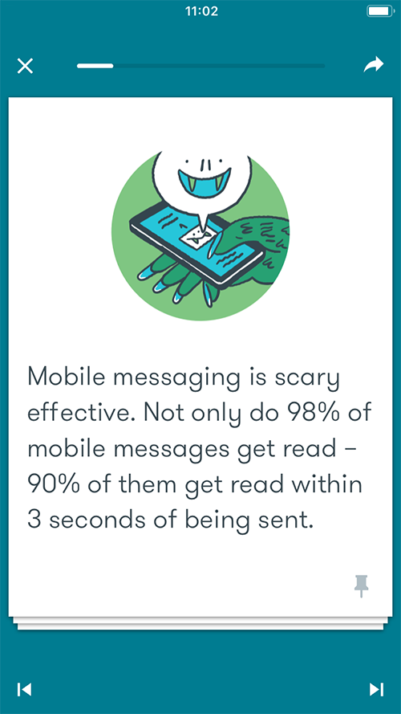
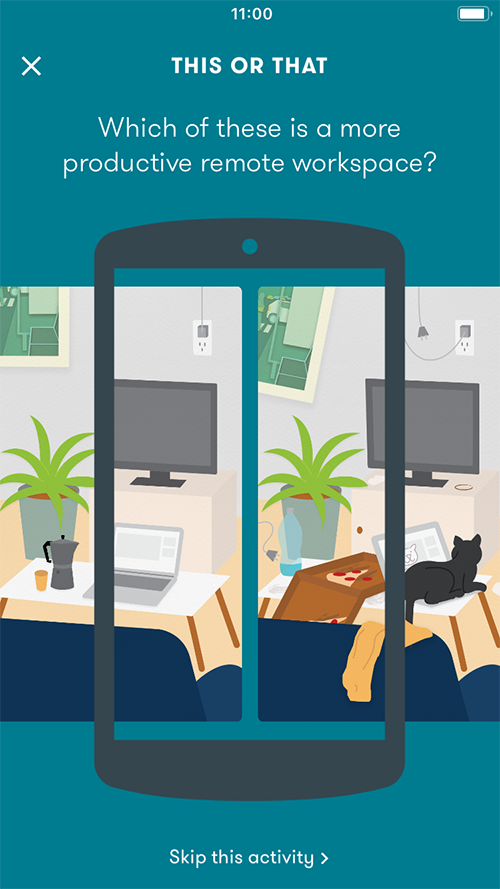

# Google Primer app
 

As Senior Writer at the educational mobile app Google Primer, I was responsible for producing all creative content, product & UX copy, and marketing materials. I worked with a small team, collaborating daily with product, design, and marketing specialists. Primer was available in over 10 languages and even more locations around the world, meaning the copy I wrote needed to be easily translatable and applicable to the professional lives of a variety of international audiences.
 
 
Since Primer was an educational app, its lesson content was essential. My job was to turn complex business topics into short, 5-minute lessons that anyone could understand and quickly apply to their business or career. Each lesson included easily digestible cards, plus interactions that I wrote and coded in JSON. 
 

 
 
---
 
In addition to producing creative content, I was responsible for all of Primer’s product and marketing copy. During my time at Primer, I oversaw several major product updates, including the creation of a searchable lesson catalog, the addition of new skills, and an update of our onboarding process: 

### Searchable lesson catalog
Previously, the only way to explore Primer’s offerings was to download the app. To make our content more searchable, I led an effort to overhaul our website. I chose the heading “Lesson Catalog,” and created brief descriptions of Primer’s skills (e.g. Workplace Inclusivity, Career Development, Staffing) and of the macrocategories these skills belong to (e.g. Business & Operations, Brand & Identity), all the while mindful of keywords, SEO, and behavioral science.
 
 

 

### New skills
Below is the launch alert and user flow that went out to existing Primer users when we added 8 new skills to the lesson catalog. This allowed users to review and update their chosen skills, which influences what lessons and minicourses appear in their Home tab.
 
 

 

### Segmented onboarding
To further personalize the app experience for users, we added 4 distinct personas users can pick from, and updated the onboarding process accordingly. When choosing titles for the personas and language for the onboarding screens, I paid close attention to research our marketing team had done on segmented value propositions and consulted with Google’s Behavioral Economics team and Material Design best practices.
 
 

 
---
Finally, in addition to writing short copy, I turned Primer lessons into longer-form pieces which I have ghostwritten for the Google’s marketing blog Think with Google (link in image below).
 

