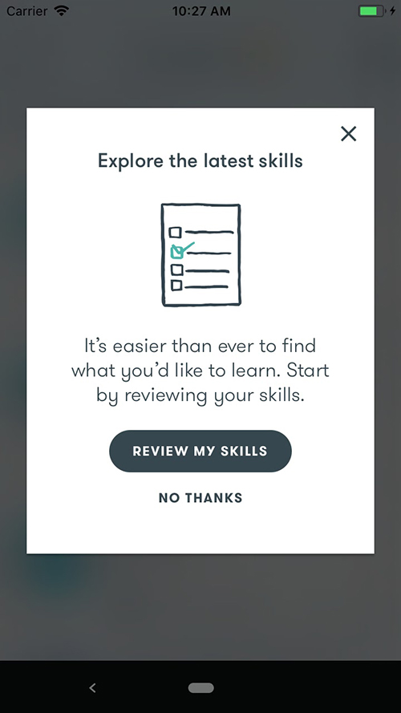
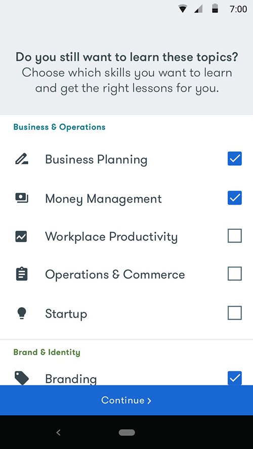

# Google Primer - Content, Product & UX, Marketing
 
As Senior Writer at the educational mobile app [Google Primer](https://yourprimer.com), I’m responsible for producing all creative content, product & UX copy, and marketing materials. I work on a small team and collaborate daily with product, design, and marketing specialists. Primer is available in over 10 languages and even more locations around the world, meaning the copy I write needs to be easily translatable and applicable to the professional lives of a variety of international audiences.
 
 
Since Primer is an educational app, its lesson content is essential. My job is to turn complex business topics into short, 5-minute lessons that are easy for anyone to understand and quickly apply to their business or career. Each lesson includes easily digestible cards, plus interactions that I write and code in JSON. 
 

 

 
 
---
 
In addition to producing creative content, I'm responsible for all of Primer’s product and marketing copy. During my time at Primer, I have overseen several major product updates, including the creation of a searchable lesson catalog, the addition of new skills, and an update of our onboarding process: 

### Searchable lesson catalog
Previously, the only way to explore Primer’s offerings was to download the app. To make our content more searchable, I lead an effort to overhaul our website. I chose the heading “Lesson Catalog,” and created brief descriptions of Primer’s skills (e.g. Workplace Inclusivity, Career Development, Staffing) and of the macrocategories these skills belong to (e.g. Business & Operations, Brand & Identity), all the while mindful of keywords, SEO, and behavioral science.

 

### New skills
Below is the launch alert and user flow that went out to existing Primer users when we added 8 new skills to the lesson catalog. This allowed users to review and update their chosen skills, which influences what lessons and minicourses appear in their Home tab.

 

### Segmented onboarding
To further personalize the app experience for users, we added 4 distinct personas users can pick from, and updated the onboarding process accordingly. When choosing titles for the personas and language for the onboarding screens, I paid close attention to research our marketing team had done on segmented value propositions and consulted with Google’s Behavioral Economics team and Material Design best practices.

 
---
Finally, in addition to writing short copy, I have turned Primer lessons into longer-form pieces which I have ghostwritten for the Google’s marketing blog Think with Google (link in image below).

 

